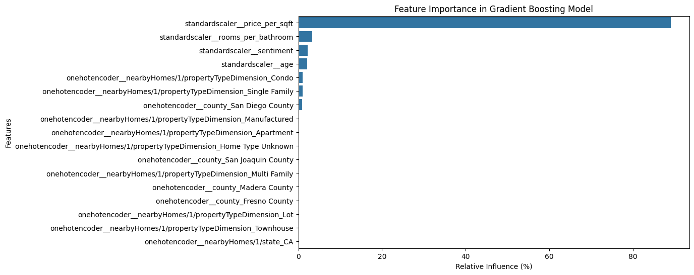
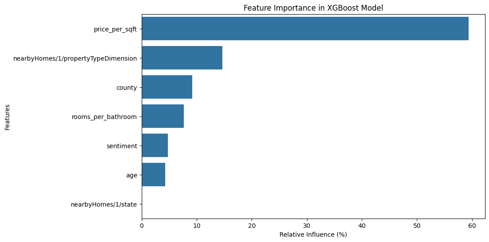
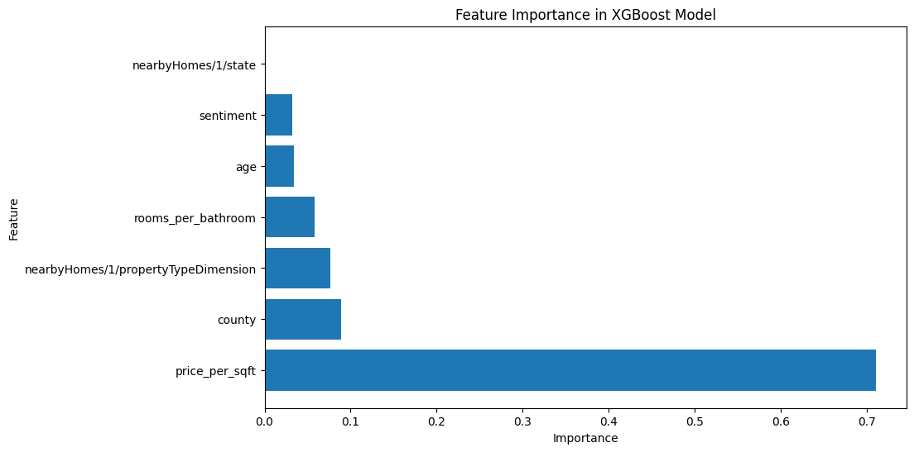
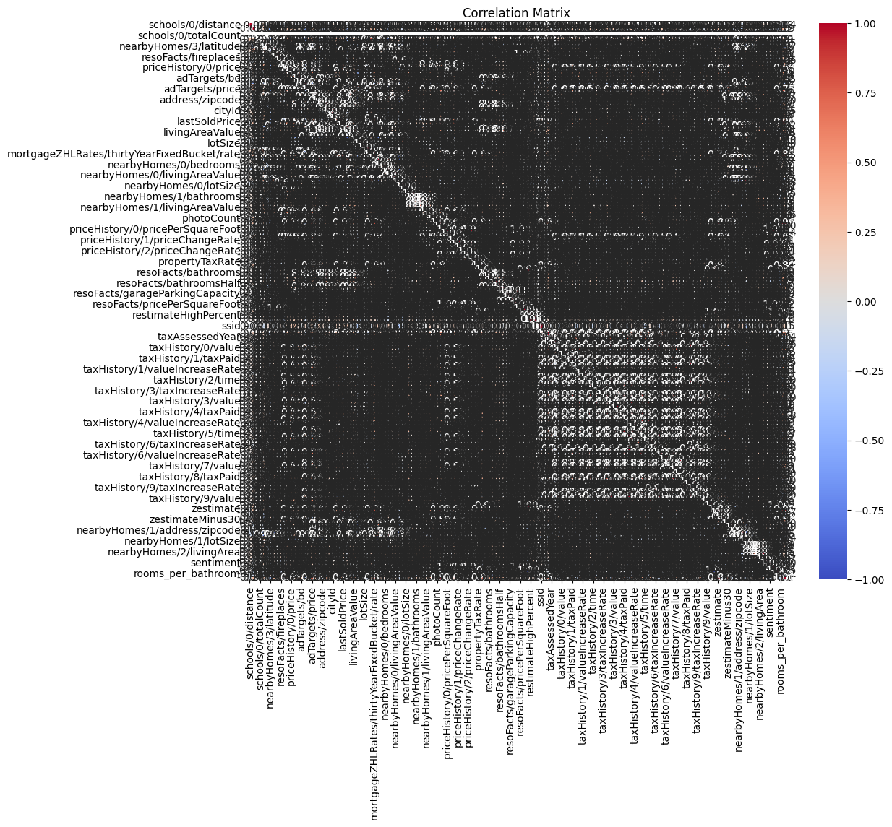
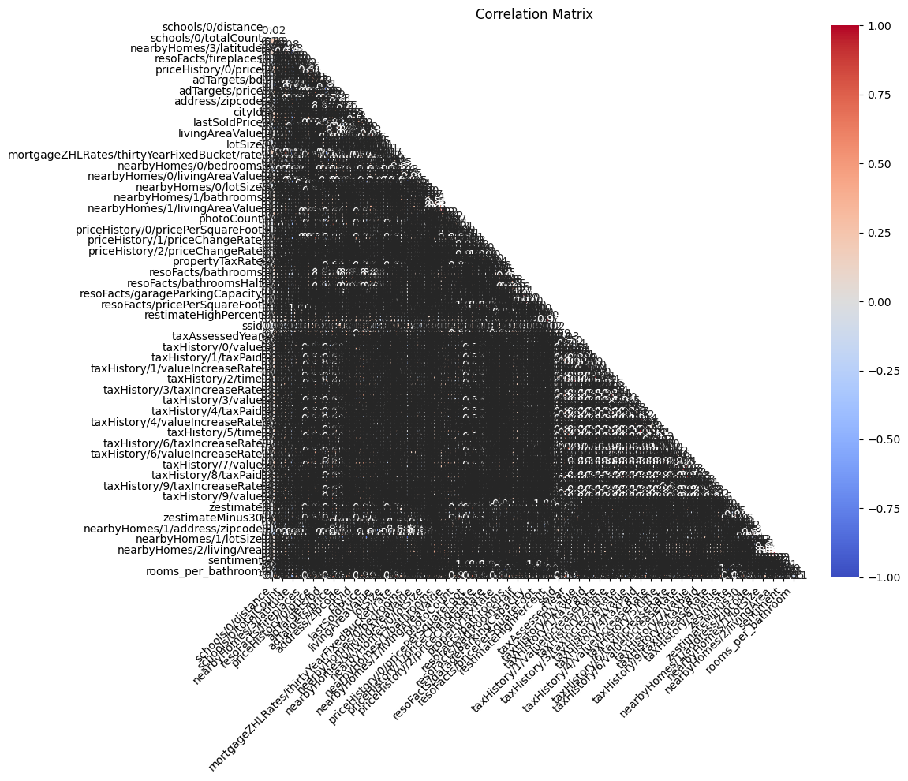

# California Housing Data Analysis

A machine learning project analyzing California rental housing data to generate pricing insights and recommendations for **LotwiZe**, a real estate platform. The project applies NLP-based sentiment analysis on property descriptions alongside regression models to predict housing prices.

---

## Project Overview

| Item | Detail |
|---|---|
| **Dataset** | `lotwize_case.csv` — California rental listings |
| **Target Variable** | `price_log` (log-transformed listing price) |
| **Models** | Gradient Boosting Regressor, XGBoost (standard + tuned) |
| **NLP** | TextBlob sentiment analysis on property descriptions |

---

## Features Engineered

- `price_per_sqft` — listing price divided by square footage
- `age` — property age derived from `yearBuilt`
- `rooms_per_bathroom` — ratio of total rooms to bathrooms
- `sentiment` — TextBlob polarity score of the property description
- `price_log` — log1p transformation applied to reduce price skew

---

## Models & Results

### Gradient Boosting Regressor

| Set | R² | RMSE | MAE |
|---|---|---|---|
| Train | 0.869 | 0.233 | 0.156 |
| Test | 0.818 | 0.272 | 0.181 |

### XGBoost (Default)

| Set | R² | RMSE | MAE |
|---|---|---|---|
| Train | 0.985 | 0.080 | 0.046 |
| Test | 0.789 | 0.293 | 0.205 |

### XGBoost (Tuned — GridSearchCV)

Hyperparameter grid searched: `n_estimators` ∈ {100, 200, 300}, `learning_rate` ∈ {0.01, 0.1, 0.2}, `max_depth` ∈ {3, 4, 5}. Best model selected via 5-fold cross-validation (RMSE).

---

## Visualizations

### Feature Importance — Gradient Boosting


### Feature Importance — XGBoost (Default)


### Feature Importance — XGBoost (Tuned)


### Correlation Matrix


### Correlation Matrix (Enhanced)


---

## Preprocessing Pipeline

1. **Imputation** — median fill for numeric columns; mode fill for categorical columns
2. **Feature engineering** — `price_per_sqft`, `age`, `rooms_per_bathroom`, `sentiment`
3. **Log transformation** — `price_log = log1p(price)` to handle right-skewed distribution
4. **Scaling** — `StandardScaler` applied to continuous features
5. **Encoding** — `OneHotEncoder` applied to categorical features inside a `ColumnTransformer` pipeline

---

## Tech Stack

- **Python** — pandas, NumPy, scikit-learn, XGBoost
- **NLP** — TextBlob, NLTK, spaCy
- **Visualization** — Matplotlib, Seaborn
- **Deep Learning (exploratory)** — TensorFlow / Keras (LSTM)

---

## Files

```
├── Copy_of_Project_1_Extention_Carlo_Castro.ipynb   # Main analysis notebook
├── images/
│   ├── feature_importance_gradient_boosting.png
│   ├── feature_importance_xgboost.png
│   ├── feature_importance_xgboost_tuned.png
│   ├── correlation_matrix.png
│   └── correlation_matrix_enhanced.png
└── README.md
```

---

## Author

**Carlo Castro** — Data Science
